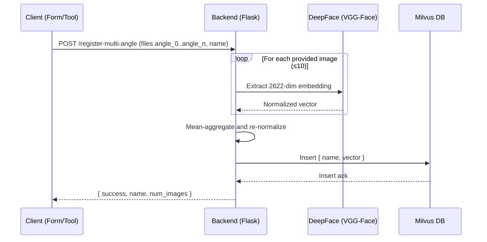
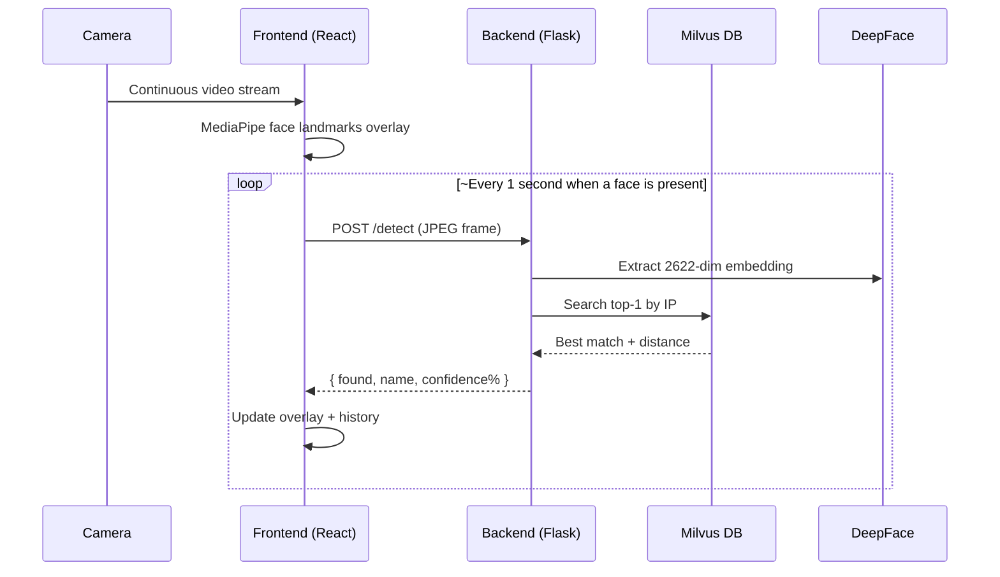

# 🏗️ System Architecture Overview

## High-Level Architecture

```
┌─────────────────────────────────────────────────────────────┐
│                    Frontend (Next.js)                       │
├─────────────────────────────────────────────────────────────┤
│  ┌─────────────────┐  ┌─────────────────┐  ┌──────────────┐ │
│  │ Real-Time       │  │ Upload (Demo)   │  │ Navbar / UI  │ │
│  │ Detection       │  │ (Cloudinary)    │  │ Components   │ │
│  └─────────────────┘  └─────────────────┘  └──────────────┘ │
└─────────────────────────────────────────────────────────────┘
                              │
                              ▼
┌─────────────────────────────────────────────────────────────┐
│                 REST API (Flask Backend)                    │
├─────────────────────────────────────────────────────────────┤
│  GET  /health                 - Health check                │
│  POST /register-multi-angle   - Register aggregated vector  │
│  POST /detect                 - Recognize from a frame      │
│  GET  /admin/faces            - List names (no vectors)     │
│  GET  /admin/faces/vector     - Inspect one vector by name  │
│  DEL  /admin/faces            - Delete by name              │
│  POST /admin/faces/clear      - Drop & recreate collection  │
└─────────────────────────────────────────────────────────────┘
                              │
                              ▼
┌─────────────────────────────────────────────────────────────┐
│              Face Recognition Engine (in Backend)           │
├─────────────────────────────────────────────────────────────┤
│  • DeepFace (VGG-Face, 2622-dim, normalized vectors)        │
│  • OpenCV (resize/align)                                    │
│  • PIL + NumPy (image handling)                             │
└─────────────────────────────────────────────────────────────┘
                              │
                              ▼
┌─────────────────────────────────────────────────────────────┐
│               Vector Database (Milvus)                      │
├─────────────────────────────────────────────────────────────┤
│  Collection: env MILVUS_COLLECTION (default: "faces")       │
│  ┌─────────────────────────────────────────────────────────┐│
│  │ Fields:                                                 ││
│  │ • pk (INT64, primary, auto_id)                          ││
│  │ • name (VARCHAR)                                        ││
│  │ • vector (FLOAT_VECTOR, dim=2622)                       ││
│  │ Index: IVF_FLAT • Metric: Inner Product (on L2-normalized)││
│  └─────────────────────────────────────────────────────────┘│
└─────────────────────────────────────────────────────────────┘
```

## Component Interactions

### 1. Multi-Angle Registration Flow (Backend implemented, UI WIP)



Notes:
- Frontend currently does not call this endpoint; a demo `UploadForm` uploads to Cloudinary only.
- When UI integration is added, capture multiple angles and submit as `angle_0..angle_9`.

### 2. Real-Time Detection Flow (Implemented end-to-end)



Notes:
- There is no `/video_feed` endpoint; detection uses periodic frame uploads.
- Frontend applies a 25% confidence threshold before showing a match.

## Data Flow Architecture

### Registration Data Flow
```
📷 Multiple images (angles)
    ↓
🧠 Face Embedding (DeepFace VGG-Face, 2622-dim, normalized)
    ↓
➗ Mean aggregation (re-normalize)
    ↓
💾 Milvus insert { name, vector }
```

### Detection Data Flow
```
📷 Live camera frame (JPEG)
    ↓
🧠 Embedding extraction (DeepFace VGG-Face)
    ↓
🔎 Milvus similarity search (Inner Product on normalized)
    ↓
📊 Confidence = distance × 100 (capped 0..100)
    ↓
👤 Display name if ≥ threshold (default 25%)
```

## Technical Stack Details

### Frontend Technologies
- **Next.js 14**: App Router
- **MediaPipe Tasks Vision**: Face landmarks and on-canvas overlay
- **Tailwind CSS**: Styling
- **React Hooks**: State and effects

### Backend Technologies
- **Python 3.11+**: Runtime
- **Flask**: Web framework + CORS
- **DeepFace (VGG-Face)**: 2622-dim embeddings
- **OpenCV**: Resize/align; image pre-processing
- **PIL/Pillow** and **NumPy**: Image and numerical ops
- **pymilvus**: Milvus client (connections, schema, search)

### Database Technologies
- **Milvus**: IVF_FLAT index, Inner Product metric
- **Embeddings**: 2622-dim FLOAT_VECTOR (normalized)
- **Fields**: `pk`, `name`, `vector`

### Configuration (Environment)
- `MILVUS_HOST` (default `127.0.0.1`)
- `MILVUS_PORT` (default `19530`)
- `MILVUS_COLLECTION` (default `faces`)
- `PORT` (Flask port, default `5000`)

## Security & Privacy

### Data Protection
- **Vectors only**: No raw face images stored in backend or DB
- **Transient processing**: Images are processed in-memory and discarded
- **CORS**: Enabled for frontend integration

### Privacy Notes
- The demo `UploadForm` posts to Cloudinary for image hosting only and does not register with the backend; remove/replace for production.

## Performance Characteristics

### Registration
- Mean aggregation of up to 10 images per person
- Single vector persisted per `name`

### Detection
- ~1s frame cadence while a face is present
- Sub-second responses on typical hardware for search top-1

## Scalability Design

### Horizontal Scaling
- Multiple Flask workers behind a load balancer (stateless API)
- Milvus server/cluster handles vector indexing and search

### Vertical/GPU
- DeepFace can leverage GPU when configured; current setup is CPU by default

## Future Enhancement Areas

### AI/Quality
- Face quality scoring and pose metadata capture (not implemented yet)
- Anti-spoofing / liveness checks

### Product/UX
- Frontend UI for multi-angle registration to call `/register-multi-angle`
- WebRTC streaming (if needed) and/or chunked uploads
