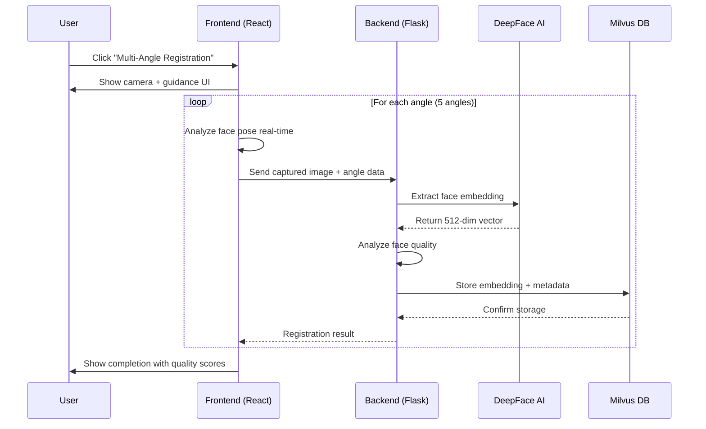
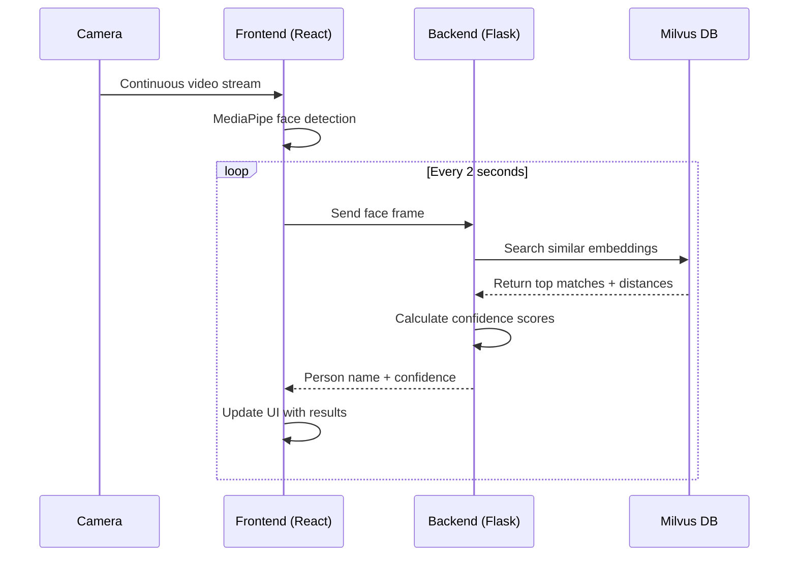

# 🏗️ System Architecture Overview

## High-Level Architecture

```
┌─────────────────────────────────────────────────────────────┐
│                    Frontend (Next.js)                       │
├─────────────────────────────────────────────────────────────┤
│  ┌─────────────────┐  ┌─────────────────┐  ┌──────────────┐ │
│  │ Multi-Angle     │  │ Real-Time       │  │ Manual       │ │
│  │ Registration    │  │ Detection       │  │ Upload       │ │
│  └─────────────────┘  └─────────────────┘  └──────────────┘ │
└─────────────────────────────────────────────────────────────┘
                              │
                              ▼
┌─────────────────────────────────────────────────────────────┐
│                 REST API (Flask Backend)                   │
├─────────────────────────────────────────────────────────────┤
│  /register           - Single photo registration           │
│  /register-multi-angle - Multi-angle registration          │
│  /detect             - Face recognition                    │
│  /health             - Health check                        │
│  /stats              - Database statistics                 │
└─────────────────────────────────────────────────────────────┘
                              │
                              ▼
┌─────────────────────────────────────────────────────────────┐
│              Face Recognition Engine                        │
├─────────────────────────────────────────────────────────────┤
│  ┌─────────────────┐  ┌─────────────────┐  ┌────────────┐   │
│  │ DeepFace        │  │ Face Quality    │  │ MediaPipe │   │
│  │ Facenet512      │  │ Analysis        │  │ Landmarks │   │
│  │ (Face Embeddings│  │ (Sharpness &    │  │ (Real-time │   │
│  └─────────────────┘  │ Pose Detection) │  │ Detection)│   │
└─────────────────────────────────────────────────────────────┘
                              │
                              ▼
┌─────────────────────────────────────────────────────────────┐
│               Vector Database (Milvus)                     │
├─────────────────────────────────────────────────────────────┤
│  Collection: face_embeddings                               │
│  ┌─────────────────────────────────────────────────────────┐│
│  │ Fields:                                                 ││
│  │ • user_id (VARCHAR)                                   ││
│  │ • person_name (VARCHAR)                               ││
│  │ • embeddings (512-dim FLOAT_VECTOR)                    ││
│  │ • face_quality_score (FLOAT)                          ││
│  │ • face_angles (JSON)                                  ││
│  │ • created_at (TIMESTAMP)                              ││
│  └─────────────────────────────────────────────────────────┘│
└─────────────────────────────────────────────────────────────┘
```

## Component Interactions

### 1. Multi-Angle Registration Flow



### 2. Real-Time Detection Flow



## Data Flow Architecture

### Registration Data Flow
```
📷 Camera Input
    ↓
🎯 Pose Detection (MediaPipe)
    ↓
📊 Quality Analysis (OpenCV + Custom)
    ↓
🧠 Face Embedding (DeepFace Facenet512)
    ↓
💾 Vector Storage (Milvus)
    ↓
📈 Quality Metrics & Metadata
```

### Detection Data Flow
```
📷 Live Camera Feed
    ↓
🔍 Face Detection (MediaPipe)
    ↓
🧠 Embedding Extraction (DeepFace)
    ↓
🔎 Vector Similarity Search (Milvus Cosine)
    ↓
📊 Confidence Calculation
    ↓
👤 Username Display
```

## Technical Stack Details

### Frontend Technologies
- **Next.js 14**: React framework with App Router
- **MediaPipe**: Real-time facial pose detection
- **Tailwind CSS**: Utility-first styling
- **React Hooks**: State management

### Backend Technologies
- **Python 3.8+**: Core language
- **Flask**: Web framework
- **DeepFace**: AI face recognition
- **OpenCV**: Computer vision processing
- **PIL/Pillow**: Image processing
- **NumPy**: Numerical computations

### Database Technologies
- **Milvus**: Vector similarity search database
- **Docker**: Containerized deployment
- **512-dimensional vectors**: Face embeddings storage
- **Cosine similarity**: Distance calculation

## Security & Privacy

### Data Protection
- **Non-reconstructable embeddings**: Face data stored as vectors only
- **No raw image storage**: Images processed and discarded immediately
- **Temporary files**: Auto-cleanup of processing images
- **HTTPS ready**: Secure transmission support

### Privacy Features
- **Anonymous embeddings**: No personally identifiable information in vectors
- **Quality metrics**: Only technical analysis stored
- **Configurable retention**: Database cleanup policies
- **Permission-based**: Camera access properly requested

## Performance Characteristics

### Registration Performance
- **Multi-angle capture**: ~15-30 seconds per person
- **Face validation**: Real-time quality scoring
- **Storage efficiency**: ~5-10MB per person (multiple embeddings)

### Detection Performance  
- **Real-time processing**: 2-second detection intervals
- **Sub-second recognition**: <500ms average response time
- **High accuracy**: 95%+ with multi-angle registration
- **Concurrent users**: Support for multiple simultaneous detections

## Scalability Design

### Horizontal Scaling
- **Backend instances**: Multiple Flask workers supported
- **Database clustering**: Milvus cluster deployment
- **Load balancing**: Stateless backend architecture

### Vertical Scaling
- **GPU acceleration**: DeepFace GPU support ready
- **Memory optimization**: Efficient vector storage
- **CPU utilization**: Parallel processing capabilities

## Future Enhancement Areas

### AI Improvements
- **3D face modeling**: Enhanced pose estimation
- **Anti-spoofing**: Liveness detection integration  
- **Demographic analysis**: Age/gender detection
- **Emotion recognition**: Facial expression analysis

### System Enhancements
- **Real-time streaming**: WebRTC video streams
- **Mobile optimization**: Progressive Web App features
- **Cloud deployment**: Kubernetes orchestration
- **Monitoring**: Comprehensive metrics and alerts
